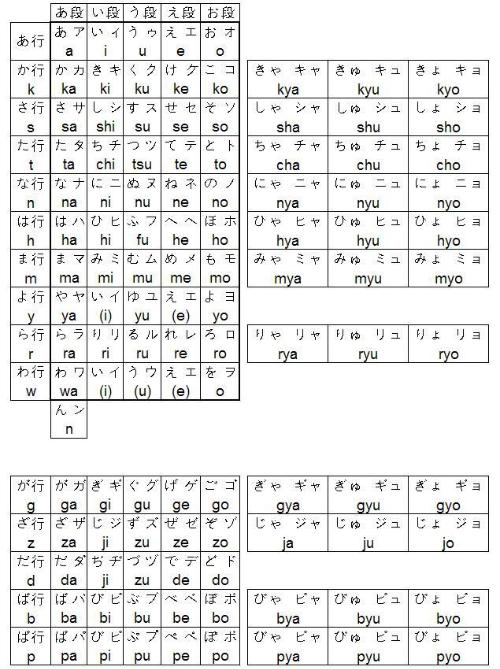
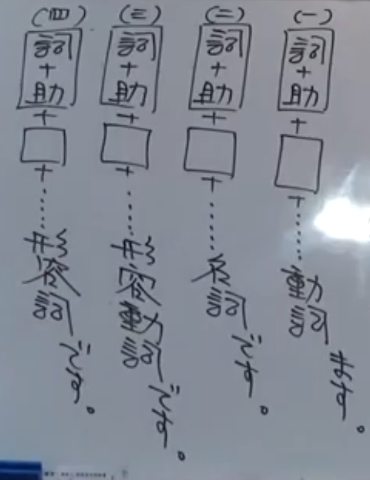
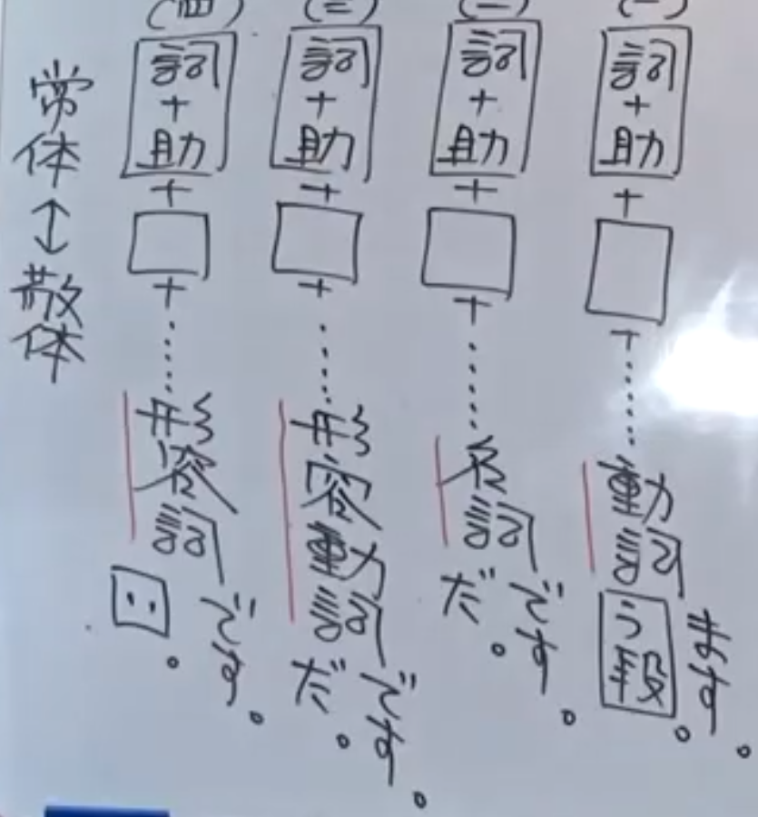
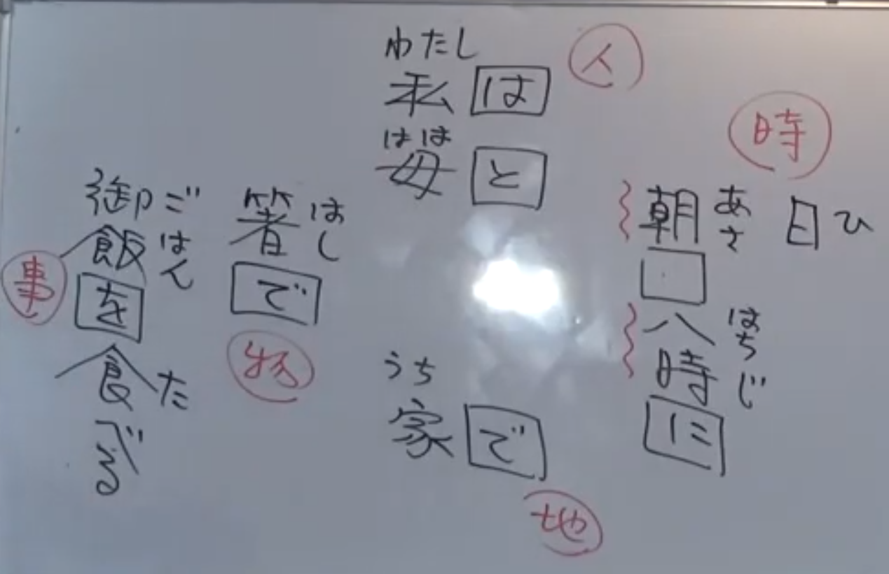
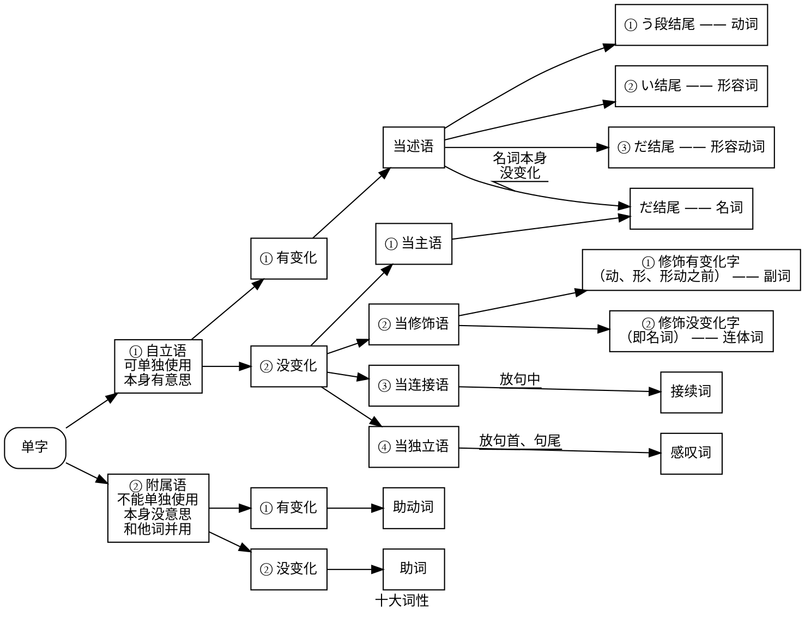
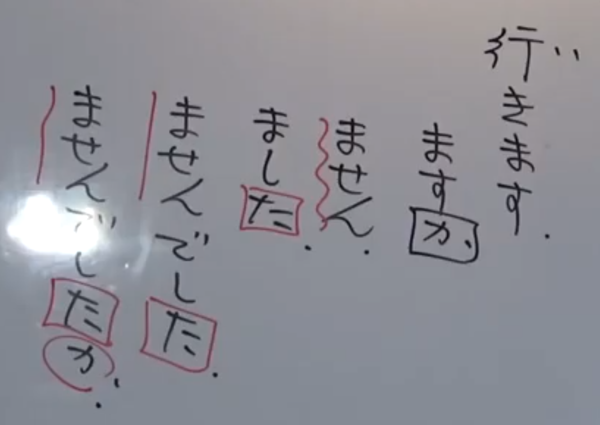

# 五十音基本概念  

1. 要找到一个动机，激励自己学习下去  
2. 先不要急着去背，要配合记一些单字  
3. 背单字要配合句子结构分析，帮助记忆单字  

- 音读（音読み/おんよみ）取其音，训读（训読/くんどく）取其义  

从句型来看，日语学习的重点：
1. 助词（大概五十个，初级日语只需十五个）  
2. 句末的变化  
> 这两个点学会就可以自修  

## 一、105个假名  

  

- 清音：5 × 10 - 5 = 45  
> -5 : (yi/ye = i/e、wi/wu/we = i/u/e)  

- 浊音：5 × 4 = 20  
- 半浊音： 5 × 1 = 5  
- 促音：1 (っ)  
> 停一拍，不发音  
> ちょっと待って  

- 鼻音：1 (ん)  
- 拗音：3 × 11 = 33  
- 长音：5  

> | 长音 | 平假名 | 片假名 |  
> | ---- | :----: | :----: |  
> | あ段 | あ | ー |  
> | い段 | い | ー |  
> | う段 | う | ー |  
> | え段 | い/え | ー |  
> | お段 | う/お | ー |  

总计：45 + 20 + 5 + 1 + 1 + 33 = 105  
其中只需要背清音（所谓五十音）  

## 二、日文句构  

只有一种：  
- [词 + 助词] 是一组  
- [词+助词] + [词+助词] + [词+助词] + … + 词 + です/ます  
- ます前面是动词，です前面是名词/形容词/形容动词  

$\Longrightarrow$ 这样就有了四种句型：  
  

- 各个组 [词 + 助词] 可以随便移动，但末尾只能放在末尾  

> 形容动词是形容词的另一种形式，作用和形容词相同，但和动词没有关系  
> 形容动词：綺麗（き れい） **い在汉字里面而不是外面**  
> 　　　　　華麗（か れい）  
> 形容词：　美（うつく）しい  

### 2.1 常体与敬体(4种句型 → 8种句型)  

- 常体：  
    - 形容词句：去掉です  
    - 动词句：去掉ます  
    - 名词句和形容动词句：だ结尾而不是です结尾，也可以不加  
- 敬体：です/ます  

> 日文的动漫、小说常用常体  

  

### 2.2 进一步的变化都在句子末尾  

- *动词*和*形容词*有变化  
- 名词和形容动词没有变化  

另外还有*助动词*：です/ます/だ  

### 2.3 句子举例  
  

## 三、十大词性  

知道了词性，就知道它在句子中的位置  

下面的图表要从后往前看，实际上给出了词性的定义  

> 形容动词和名词的变化在于“だ”，本身并不会变化  
> “だ”其实是助动词  
> 动词和形容词的变化规则相同  
> 助动词、动词、形容词在句子末尾发生变化  

> 副词有时候会摆在名词前面，但修饰的并不是名词  
> 名词+ の + 名词  
> 形容词 + 名词  
> 形容动词 + な + 名词  
> 动词（原型） + 名词  
> …… 总共有18种变化规则 （4 × 4 + 2 （复合动词、复合名词））  

## 四、接尾语  

是一定要背诵的内容  

1. か：疑问  
2. た：过去  
3. です/ます：尊敬（含变化）  
4. ば：假定（句中）  
5. て：中止，一个动作接一个动作（句中）  
6. ない：常体的否定  
7. ません：敬体的否定  
8. れる：被动  
9. せる：使役  

  

> 变到た之后就不能再发生变化了  
> 可以加か，但か不算变化  

---

## 一些单字  

愛（あい）  
合う（あう） → **以う段结尾的都是动词**  
会う（あう） ↗  
良い（いい） → **汉字+い是形容词**  

- 一些形容词：  
長（なが）い  
短い  
高い  
低い  
重い  
輕い  
白い  
黒い  
浅（あさ）い  
> 全部都是训读（取其义）  
> 人名地名的读法不按常理出牌  
