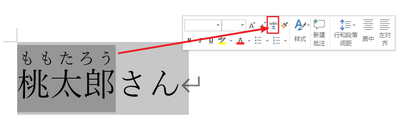

# 五十音1  

- 本堂课主要内容：按行、按段的五十音（清音）读音练习  

を（输入法是wo，但读音是o，助词）  
お（出现在单字中）  

砂糖（さと）  
塩、汐、潮（しお）  
酢（す）  
醬油（しょうゆ）  
寿司（すし）  
味噌（みそ）汁（しる）  

ラーメン（拉面，外来语）  

眉（まゆ）  
腿、桃（もも）  
耳（みみ）  
目（め）  
頬（ほほ）  
血（ち）  
胸（むね）  
父（ちち）  

- 善用Word的假名注音功能：  

  
