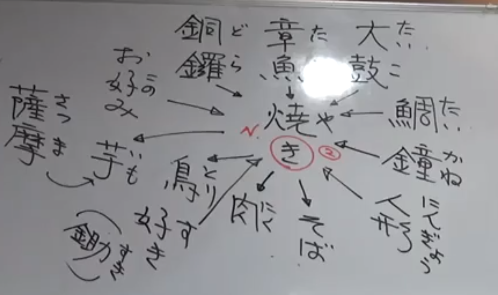

# ka行  

- 单字不用急着背诵，关键是先掌握规律和方法  

無（む、ぶ）謀（ぼう）  
略（りゃく）  

言（い）う  
いいえ  

---

## あ行的片假名  

阿 ア アイ eye  
伊 イ イア ear  
宇 ウ ウエア wear  
江 エ エア air  
於 オ オア ore  

---

## かきくけこ  

蚊（か）  
牡蠣、柿（かき）  
書（か）く  
過去（かこ）  
木（き）  
菊（きく）、聴（き）く、聞（き）く  
九（く）  
毛（け）  
子（こ）  
国（こく）  
此処（ここ）  

赤（あか）  
秋（あき）  
池（いけ）  
駅（えき）  
> 地名+駅变为专有名词  
> 駅伝（でん） 马拉松  

声（こえ）  
空気（くうき）  

赤 n  
赤い adj  
- **adj去掉い → n**  

## 数字  
零（れい、ゼロ、〇（まる））  
一（いち）  
二（に）  
三（さん）  
四（し、よん）  
五（ご）  
六（ろく）  
七（しち、なな）  
八（はち）  
九（く、きゅう）  
十（じゅう）  
百（ひゃく）  
千（せん）  
万（まん）  
億（おく）  
兆（ちょう）  

　よん 四 し  
　なな 七 しち  
きゅう 九 く  

如果某个单位采用了左边的读音，则四七九都采用这侧的读音，例：  
- 歳（さい） 左边（90%都采用这种读音）  
- 時（じ） 右边，但有特例：四（よ）時  

- 十百千前面不加“一”  
> 1111：千百十一  

---

丸（まる）い  
焼（や）く、焼（や）き  

章魚（たこ）焼き  
鯛（たい）焼き  
太鼓（たいこ）焼き  
鐘（かね）焼き  
人形（にんぎょう）焼き  
銅鑼（どら）焼き  
> 哆啦A梦：銅鑼エモン（衛門）  

- **动词→名词：末尾的う段变い段**  

焼き蕎麦（そば）  
お好（この）み焼き  
焼き肉（にく）  
焼き鳥（とり）  
焼き芋（いも）  
薩摩（さつ ま）芋（いも） （红薯）  
すき焼き （寿喜锅）  
鋤（すき）  

  

お金（かね）  
沢山（たくさん）  
沢庵（たくあん） （腌萝卜）  
半沢直樹（はん ざわ なお き）  
倍返（ばい がえ）し 返（かえ）す  
> 这里“返”的读音不同？？？  

軽（かる）い  
軽井沢（かるいざわ）  
青い（海（うみ））（森（もり））（空（そら））  
緑（みどり）  

虹（にじ）  
西（にし）  
口紅（くち べに）  

---

## 颜色  

赤（あか）  
橙（だいだい） オレンジ  
黄色（きいろ）  
緑（みどり）  
青（あお）  
藍（あい） 靛  
紫（むらさき）  

---

- 和歌（わか） ５７５７５  
- 俳句（はいく） ５７５ 

松尾（まつお）芭蕉（ばしょう）  
> 日本的李白杜甫  

奥（おく）の細道（ぼそ みち）  

寂（さび、わび）しい （寂寞、孤寂）  

百人一首（ひゃくにんいっしゅ）  

---

## 词语辨析  

音（おと） 无生命  
声（こえ） 有生命  
ボイス 无区分  

卵（生）、玉子（熟）  
ミルク（加工）、牛乳（ぎゅうにゅう）（生牛乳）  
炒（い）る（加水）、炒（いた）める（不加水）  

---

天気（てん き）  
電気（でん き）  
空気（くう き）  
気持ち（き も ち） ← 持（も）つ  
> n ← v  
> き：母字，很多词汇都围绕这个单字  

---

## か行的片假名  

加 カ カー car  
幾 キ キウイ kiwi  
久 ク クッキー cookie  
介 ケ ケーキ cake  
己 コ コーク coke  

---

## さしすせそ  

砂糖（さと）  
塩（しお）  
酢（す）  
醬油（しょうゆ）  
味噌（みそ）汁（しる）  

刺（さし）身 ← さす v  
四（し）  
紫蘇（しそ） 生鱼片下面的绿色叶子  
酢、巣（す）  
寿司（すし）  
背（せ）  
> 背広（せ びろ） 西服  
> 広（ひろ）い  
> 变音的规律，以后再讲  

咲（さ）く  
> 桜が咲く  

塩（しお）  
好（す）き  
> 嫌（きら）い 唯一的例外，以い结尾不是形容词  

吸（す）う  
世界（せかい）  
今朝（けさ）  

